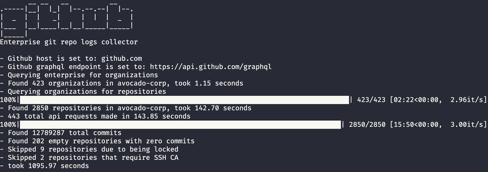

# Run a `git log` via `git clone` on every repository in a GitHub enterprise


18 minutes to read every commit in 2k+ repos in 400+ orgs which included three instances of the Linux kernel using 120 processes for cloning. 

## What is this?
This script queries the GraphQL API for GitHub organizations belonging to a specific enterprise and generates a list of all organizations and their associated repositories. Once a list has been generated, the script will then clone each repository and generate a git log of all commits and associated data in csv format.

You can modify the print format:
```
--pretty=format:'{org},{repo},%H,%ct,%an,%ae,%S,%s'
```

see [git-log](https://git-scm.com/docs/git-log) for format documentation. NOTE: Commit messages are likely to contain commas, be careful!


## Why?
This script was created for a customer with 2000 plus organizations and over 200,000 repositories. The customer wanted to be able to generate a list of all repositories and their associated commits. This script was created to help them generate this data in a timely manner versus using the API to generate the data which would take days to complete.

## Requirements and how it works
1. You need an enterprise owner account with access to the GraphQL API. You can create a personal access token for this account.
2. You need to know the name of the enterprise you want to query. You can find this in the URL of the enterprise.
3. Its recommended you do this on a Linux machine with fast disks/IOPS and with ample CPU/Cores. This allows you to take advantage of the multiprocessing capabilities of the script.
4. This script will clone all repositories and generate a git log for each repository. This can take a long time depending on the size of the enterprise.
5. Initial data collection via the API is serial with recursive pagination. This feature supports multiprocessing but you will likely hit secondary rate limits scaling it past 2 processes. It's recommended you leave this at 1. 
6. Because this script supports multiprocessing its important you do not overburden the system it's running against. It's recommended you start with 4 clones at a time and scale up from there. You may also want to run this during low usage times if possible.
7. Once the `git log` csv file generated, the script will then remove the cloned repository. This is to save disk space. 
8. See `requirements.txt` for python dependencies (`gql`,`tdqm`)

## Install
```
pip install -r requirements.txt
```

## Other notes
1. Repos using SSH CA cannot be cloned
2. Locked repos cannot be cloned
3. This script will not tolerate being IP blocked, it will just fail. Make sure the organization you are querying is not blocking your IP.
4. Everything is HTTPS, no SSH support

## Usage
```
usage: git-repo-logs.py [-h] -e ENTERPRISE [-n [HOST]] [-t [TOKEN]] [-c [CLONING_PROCESSES]]
                        [-a [API_PROCESSES]]

Obtain git logs for all org repos in a single enterprise

required arguments:
  -e ENTERPRISE, --enterprise ENTERPRISE
                        GitHub Enterprise name/slug

options:
  -h, --help            show this help message and exit
  -n [HOST], --host [HOST]
                        GitHub Enterprise hostname (domain.tld)
                        gets/sets GITHUB_HOST env var
  -t [TOKEN], --token [TOKEN]
                        GitHub Enterprise admin PAT token
                        gets/sets GITHUB_TOKEN env var
  -c [CLONING_PROCESSES], --cloning_processes [CLONING_PROCESSES]
                        number of processes to use when cloning
  -a [API_PROCESSES], --api_processes [API_PROCESSES]
                        number of processes to use when traversing repos via the api
                        NOTE: keep this low to avoid rate limiting
```
